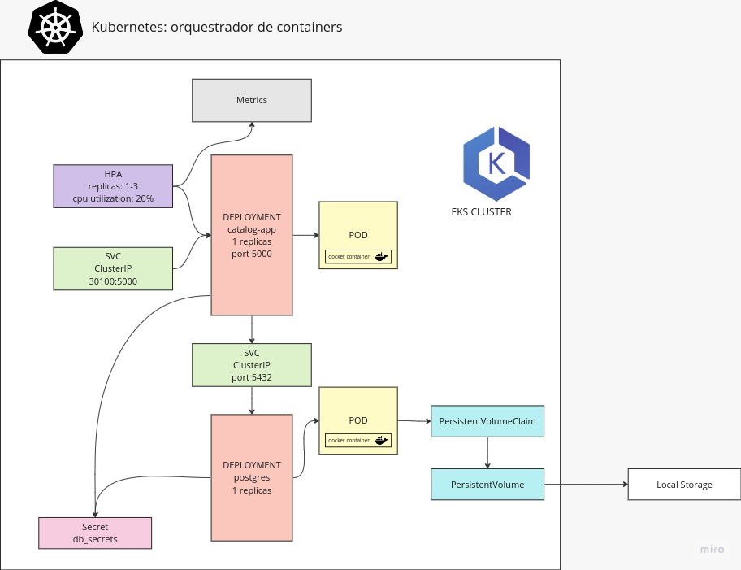

## Sistema de criação e gerenciamento de pedidos realizado para o Tech Challenge FIAP - SOAT - Grupo 31

Miro: https://miro.com/app/board/uXjVNe56-bI=/?share_link_id=839163216515<br>
Postman: https://documenter.getpostman.com/view/28694171/2s9YRCXrYf<br>
Video: 

# Arquitetura da Aplicação

## Arquitetura Kubernetes



## Arquitetura Código


1 - Usuário faz uma requisição: Um usuário interage com a aplicação fazendo uma requisição.

2 - Adapters / Entrypoints: A requisição atinge os entrypoints da API, que são os controladores (*_views.py), que interpretam os dados da requisição.

3 - Aplicação / DTOs: Os dados da requisição são então mapeados para Data Transfer Objects (DTOs), que são objetos usados para transferir dados entre processos. No caso, poderiam ser as classes em requests ou responses.
Aplicação / Caso de Uso: Os DTOs são passados para a lógica de negócios da aplicação, representada pelos casos de uso (*_usecase.py). Aqui, a requisição é processada de acordo com as regras de negócio.

4 - Domínio / Entidades: Os casos de uso operam em entidades do domínio (client.py, order.py, payment.py, product.py), que são as representações de negócio puras e contêm a lógica de negócios fundamental.

5 - Portas / Ports: Em seguida, os casos de uso interagem com os ports (*_port.py), que abstraem a comunicação com os adaptadores de infraestrutura externa.

6 - Infraestrutura / Repositórios: Por meio dos ports, os casos de uso interagem com os repositórios na camada de infraestrutura (*_repository.py). Estes repositórios abstraem a lógica de acessar o repositório de dados.

7 - Infraestrutura / Modelos de Banco de Dados: Os repositórios manipulam modelos de banco de dados (*_model.py) que são mapeamentos de entidades do domínio para tabelas de database.

Retorno da Requisição: Depois que a lógica de negócios é processada e os dados são persistidos ou atualizados conforme necessário, os resultados são então mapeados de volta para DTOs e enviados de volta pelos ports e adapters para a interface de usuário ou cliente

*Observação: A implementação atual utiliza um sistema de fake checkout em vez de integrar com o serviço real do MercadoPago. O componente 'Fake Checkout' simula o fluxo de pagamento e está contido dentro do container da aplicação web para desenvolvimento e testes. 

# Guia Rápido para Executar a Aplicação Flask
Este guia rápido descreve como configurar e executar a aplicação Flask usando Docker Compose e migrações de banco de dados.

## Opção 1: Inicie o Ambiente com o Docker Compose
Certifique-se de ter o Docker Compose instalado em sua máquina. Se não o tiver, instale-o.
No diretório raiz do projeto, execute o seguinte comando para iniciar o ambiente:
```
docker compose up --build -V
```
Isso criará e iniciará os contêineres necessários para a aplicação.
Acesse o serviço pela url [http://localhost:5000](http://localhost:5000)


## Opção 2: Inicie o Ambiente com kubernetes
Primeiramente instale o `kubectl` para manipular o cluster kubernetes, de acordo com a [documentação oficial](https://kubernetes.io/docs/tasks/tools/#kubectl).

Agora é necessário utilizar um cluster local para executar o ambiente. Existem diversos clusters que podem ser utilizados, porém recomendamos a utilização do minikube. Instale-o conforme a [documentação](https://minikube.sigs.k8s.io/docs/start/). Para a instalação do minikube é importante ter o [Docker](https://docs.docker.com/) instalado em sua máquina.
Após a instalação do minikube, inicie o cluster com:

```
minikube start
```

No diretório raiz do projeto, execute o comando:
```
kubectl apply -f kubernetes
```

Esse comando criárá todos os recursos necessários para que a aplicação rode corretamente no clustes.

Espere até que todos os pods da aplicação estejam prontos (para acompanhar os pods subindo, execute `kubectl get pods --watch`)

Após os pods estarem prontos, para acessar a aplicação execute:

```
minikube service svcfiaptechchallenge 
```

ou direcione a porta da aplicação no cluster para o seu host local, com:

```
kubectl port-forward service/svcfiaptechchallenge 5000:80
```

e acesse o serviço pela url [http://localhost:5000](http://localhost:5000)

# Coverage Testes

